# arkplatte

arkplatte 为明日方舟角色主题科研绘图提供 Python 库和 R 包，适合连续数值、正负差异、分组注释、热图、火山图、UMAP 和 plot1cell 等常见场景。

配色采用固定校准表，覆盖 417 名干员；头像近景优先用于角色本体取色，立绘作为备用来源。函数读取固化后的 palettes.csv，保证同一角色在不同图中保持稳定视觉语义；。

色阶生成结合 Lab 感知色彩空间插值、亮度单调约束、双向色阶高亮中点、两端亮度对称和分类色最大距离选择。单细胞数据可用大类绑定角色主题，小类在同一主题内自动挑选距离更合适的颜色，从而兼顾层级关系和类别区分度。


## 在线教程

[https://misaka-15134.github.io/arkplatte/](https://misaka-15134.github.io/arkplatte/)

## 安装

Python：

```bash
pip install "git+https://github.com/Misaka-15134/arkplatte.git#subdirectory=python"
```

R：

```r
install.packages("remotes")
remotes::install_github("Misaka-15134/arkplatte", subdir = "R")
```

本地开发安装：

```bash
git clone https://github.com/Misaka-15134/arkplatte.git
cd arkplatte/python
pip install -e ".[test,plot]"
```

```r
install.packages("devtools")
devtools::install("R")
```

## 快速开始

Python：

```python
import arknights_palette as akp

akp.arkplatte("浊心斯卡蒂", 6)
akp.arkplatte_seq("塑心", 7)
akp.arkplatte_div("浊心斯卡蒂", 7)
akp.arkplatte_cat(8, seed=1)
```

R：

```r
library(arknightsPalette)

arkplatte("浊心斯卡蒂", 6)
arkplatte_seq("塑心", 7)
arkplatte_div("浊心斯卡蒂", 7)
arkplatte_cat(8, seed = 1)
```

输出示例：

```text
# 核心色
#5FAFC8 #B94752 #7E8FB5 #171A2A #DDE7EE #5C6477

# 单向连续色
#F1EBE9 #DED8DB #B1ABB3 #79747F #44414C #1F1F27 #101219

# 双向连续色
#CC6C71 #D39092 #EECACC #EDEEF2 #BED7E2 #76A9BB #3993AC
```

## 效果展示

|  |  |  |
|---|---|---|
| 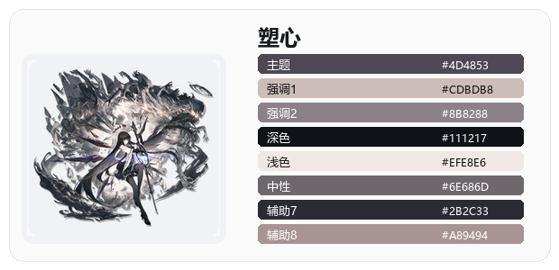 | 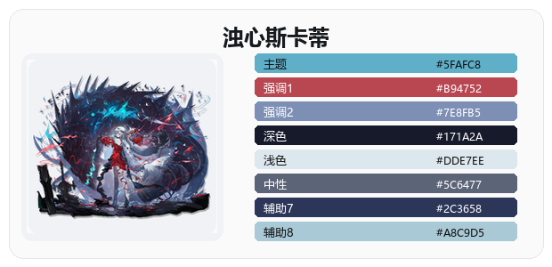 | 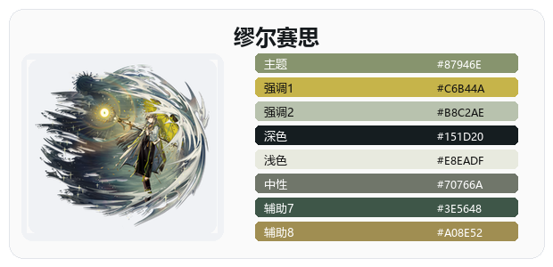 |
| 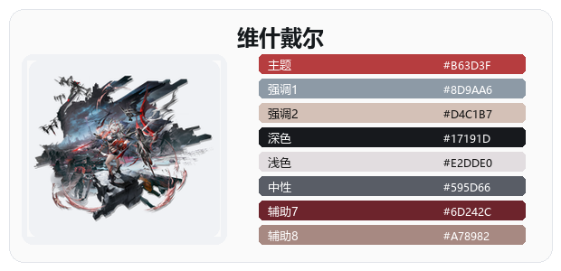 | 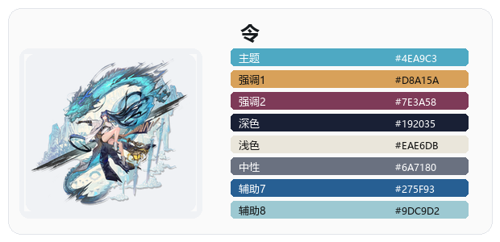 | 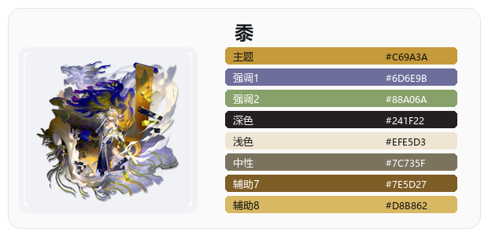 |
| 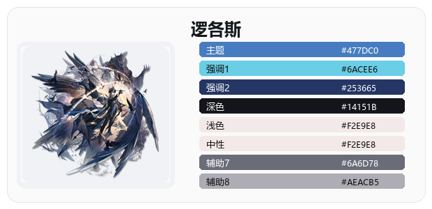 | 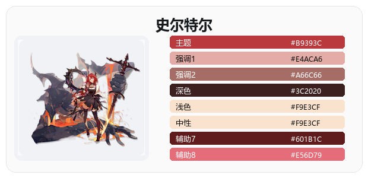 | 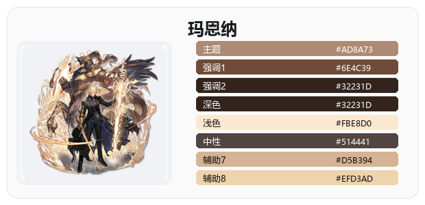 |
| 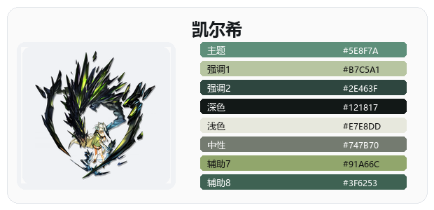 | 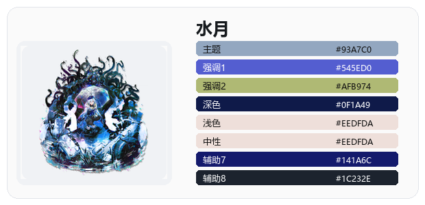 | 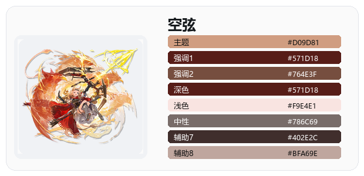 |

完整网页教程源码见 [docs/index.html](docs/index.html)。

## 函数及使用方法

| 函数 | Python | R | 用途 |
|---|---|---|---|
| 核心色与统一入口 | `akp.arkplatte(name, n=None, kind="core")` | `arkplatte(name, n = NULL, type = "core")` | 读取角色核心色，也可切换为单向或双向连续色。 |
| 单向连续色 | `akp.arkplatte_seq(name, n=256)` | `arkplatte_seq(name, n = 256)` | 适合 0 到 1、表达量、得分、丰度等非负数值。 |
| 双向连续色 | `akp.arkplatte_div(name, n=257)` | `arkplatte_div(name, n = 257)` | 适合 -1 到 1、差异值、残差、相关系数等有正负方向的数值。 |
| 分类色 | `akp.arkplatte_cat(n, seed=None, large_n="warn", optimize=True)` | `arkplatte_cat(n, seed = NULL, large_n = "warn", optimize = TRUE)` | 按 Lab 感知色彩空间距离挑选分散颜色；超过 30 类默认提醒。 |
| 细胞类型色 | `akp.arkplatte_cell(celltypes, seed=1, large_n="warn")` | `arkplatte_cell(celltypes, seed = 1, large_n = "warn")` | 给细胞类型名称直接分配颜色，适合单细胞注释图。 |
| 分层细胞类型色 | `akp.arkplatte_sub(subtype_map, group_operator)` | `arkplatte_sub(subtype_map, group_operator)` | 大类绑定角色主题，小类在同一主题内自动挑选分散颜色。 |
| 名称与信息 | `akp.arkplatte_names(rarity=None)` | `arkplatte_names(rarity = NULL)` | 默认返回全部干员；设为 `6` 时只返回六星。 |
| 主题色 | `akp.arkplatte_theme(names)` | `arkplatte_theme(names)` | 快速提取多个角色的主题色。 |

## 常见科研图

双向柱状图：

```python
div = akp.arkplatte_div("浊心斯卡蒂", 7)
colors = [div[6], div[5], div[1], div[0], "#8F3343"]
ax.axhline(0, color="#AFAFAF")
ax.bar(labels, values, yerr=err, color=colors)
```

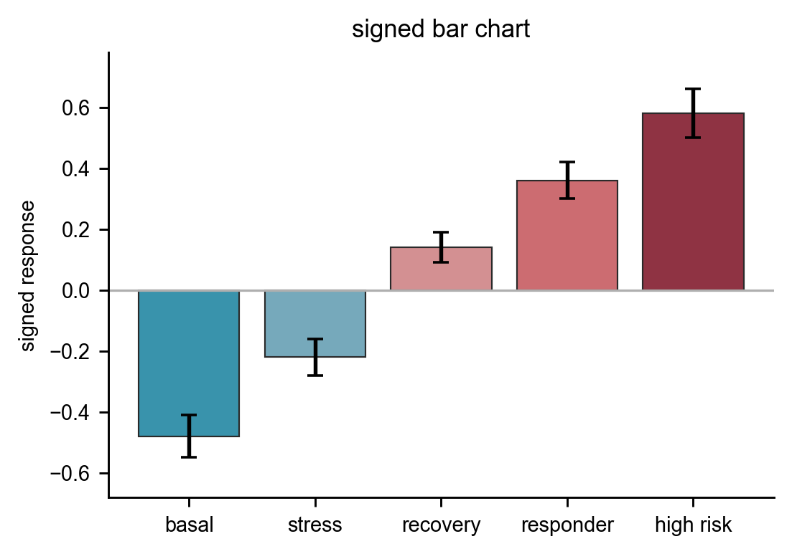

热图：

```python
cmap = akp.arkplatte_cmap("乌尔比安", "div", 9)
ax.imshow(mat, cmap=cmap, vmin=-2.4, vmax=2.4)
```

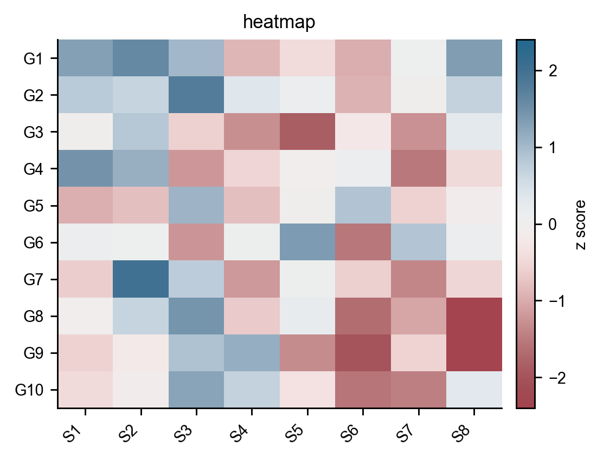

森林图：

```python
colors = akp.arkplatte("维什戴尔", 8)
ax.errorbar(effect, y, xerr=ci, fmt="o", color=colors[i])
```

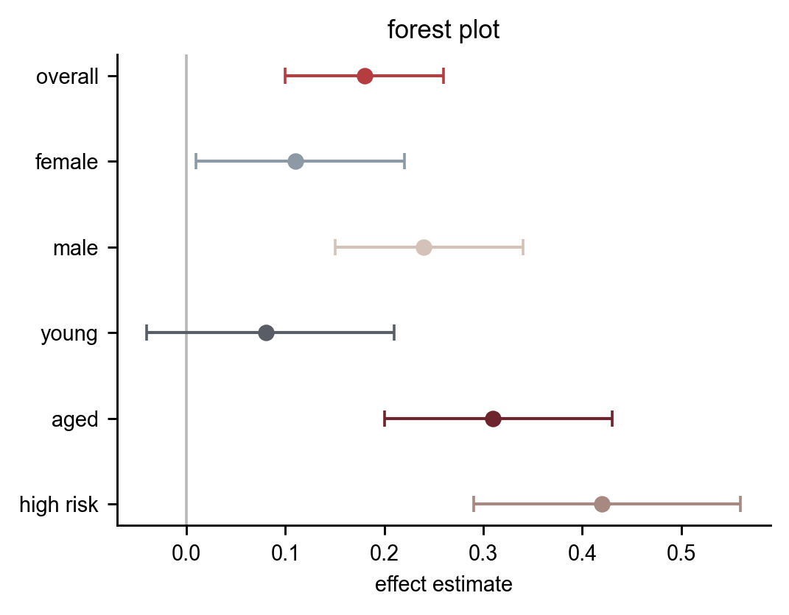

## 单细胞用法

普通细胞类型颜色：

```python
celltypes = adata.obs["cell_type"].astype(str)
cluster_palette = akp.arkplatte_cell(celltypes, seed=4)
```

大类与小类分层颜色：

```python
subtype_map = {
    "Immune": ["T cell", "B cell", "Macrophage"],
    "Epithelial": ["AT1", "AT2"],
}

group_operator = {
    "Immune": "凯尔希",
    "Epithelial": "浊心斯卡蒂",
}

subtype_palette = akp.arkplatte_sub(subtype_map, group_operator)
```


## 数据与方法

数据文件：

```text
python/arknights_palette/data/operators.csv
python/arknights_palette/data/palettes.csv
R/inst/extdata/operators.csv
R/inst/extdata/palettes.csv
```

色阶规则：

- 单向连续色在 Lab 感知色彩空间插值，并强制亮度单调变化。
- 双向连续色使用高亮中点和亮度对称的两端。
- 分类型色板按 Lab 色彩距离挑选分散颜色。
- 单细胞分层配色会根据每个大类下的小类数量扩展候选色，再选取距离更合适的颜色。


## 版权说明

本仓库只包含颜色表和代码，不包含原始明日方舟立绘。角色名称和相关素材版权归其权利方所有。
