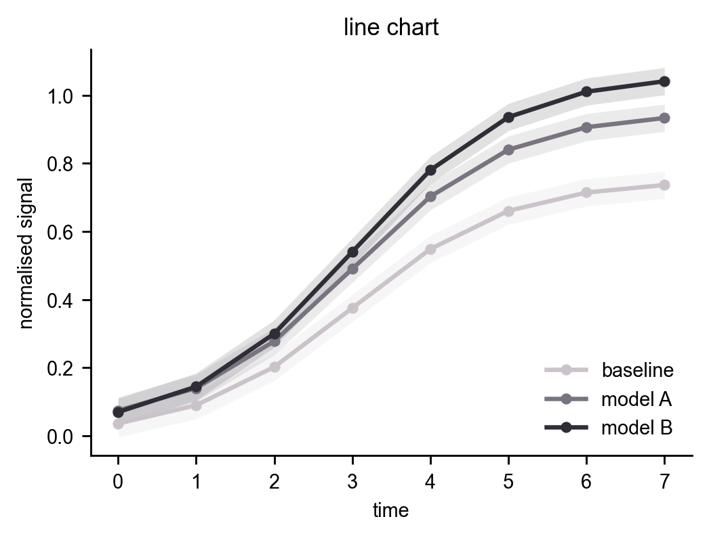
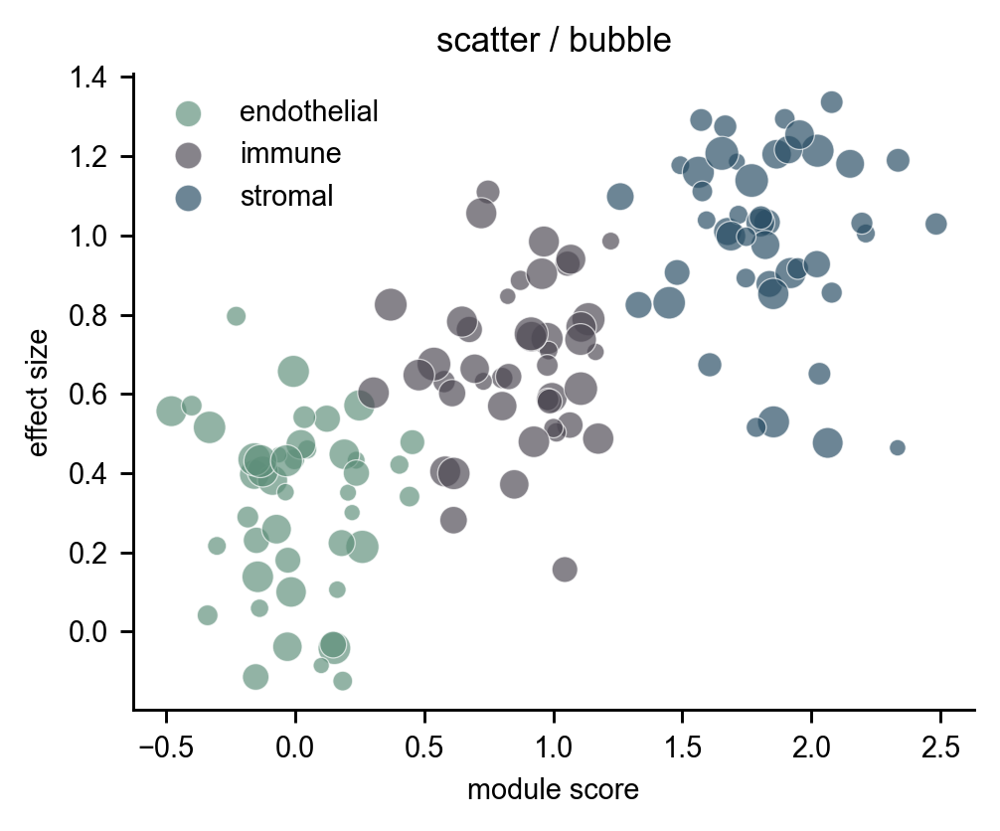
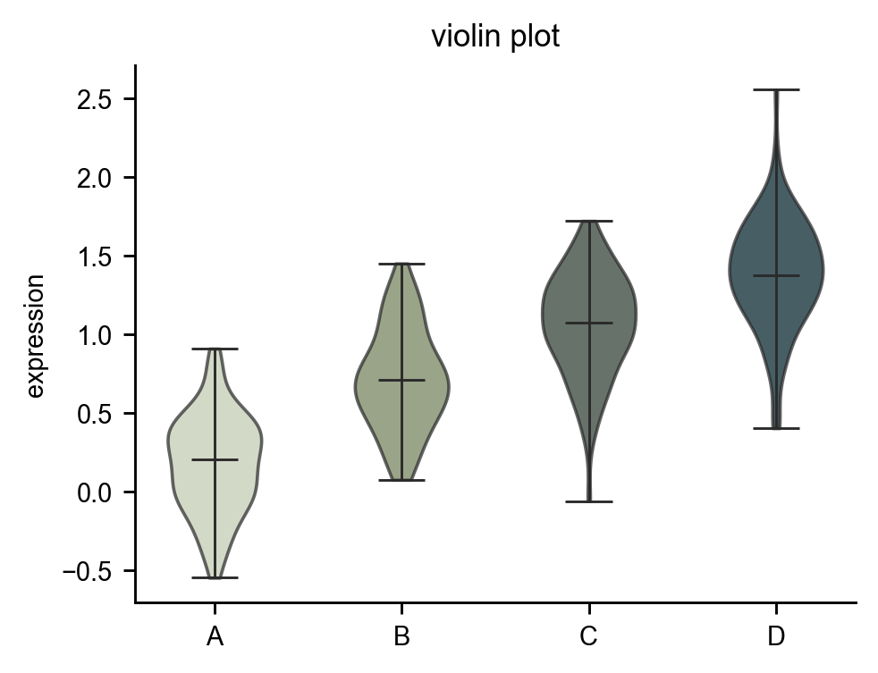
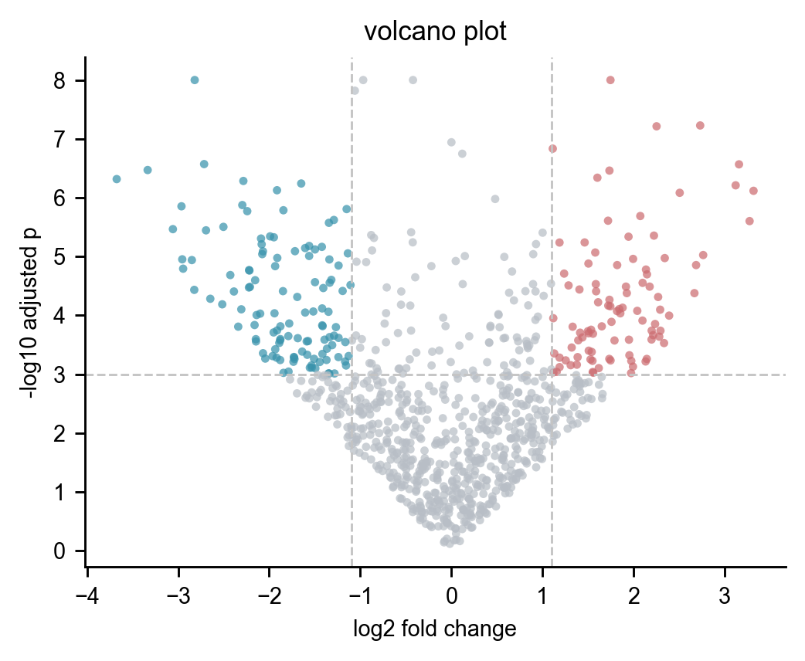
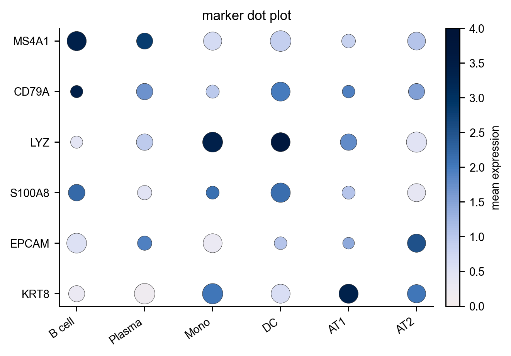
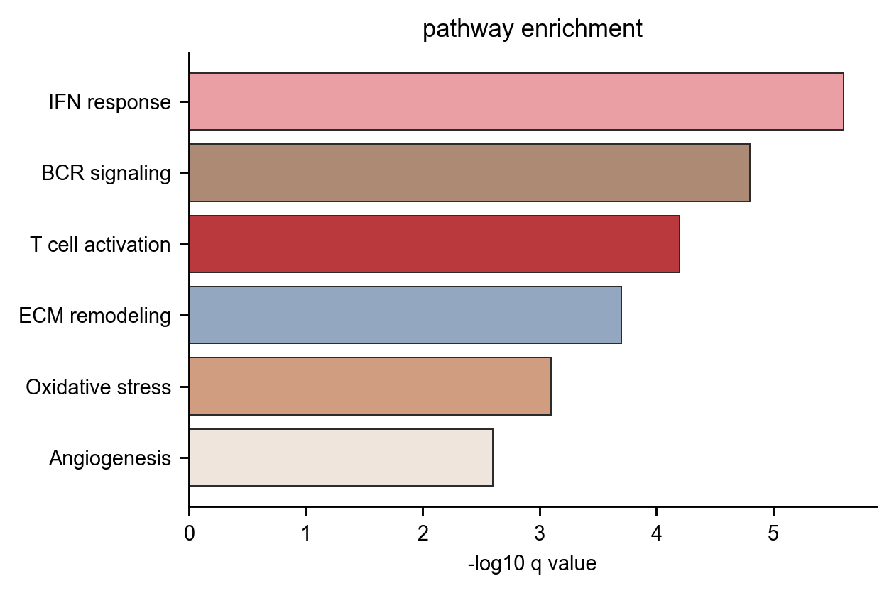
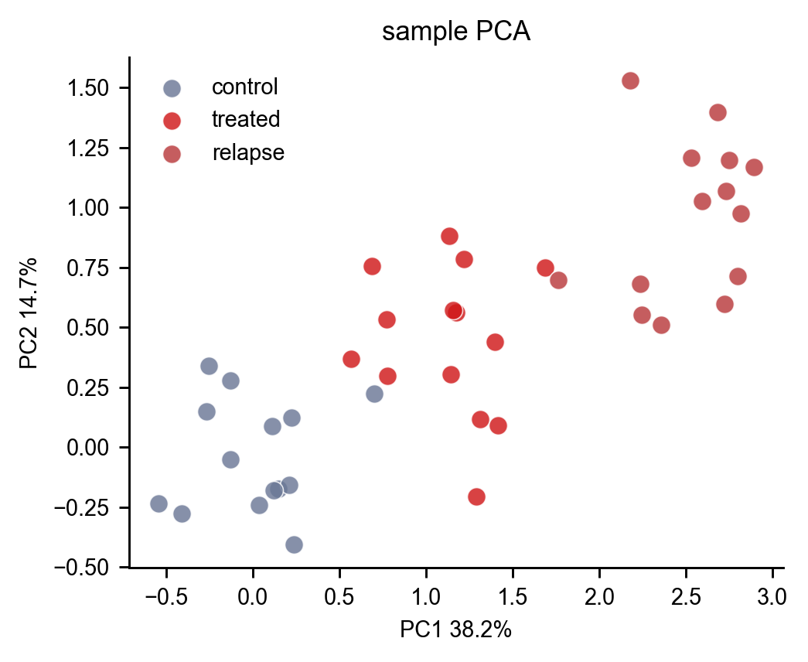
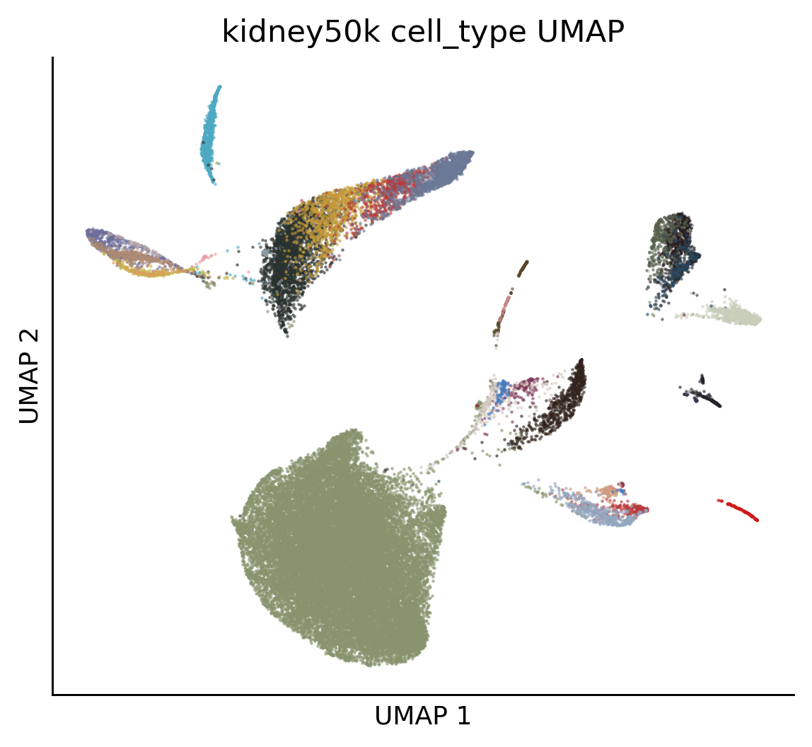
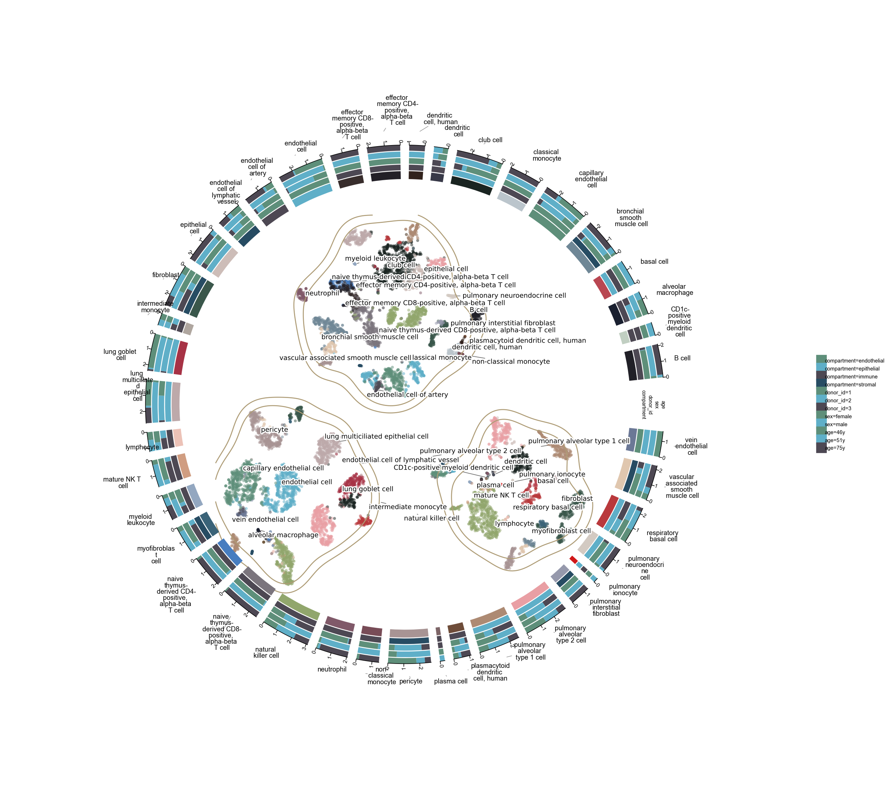
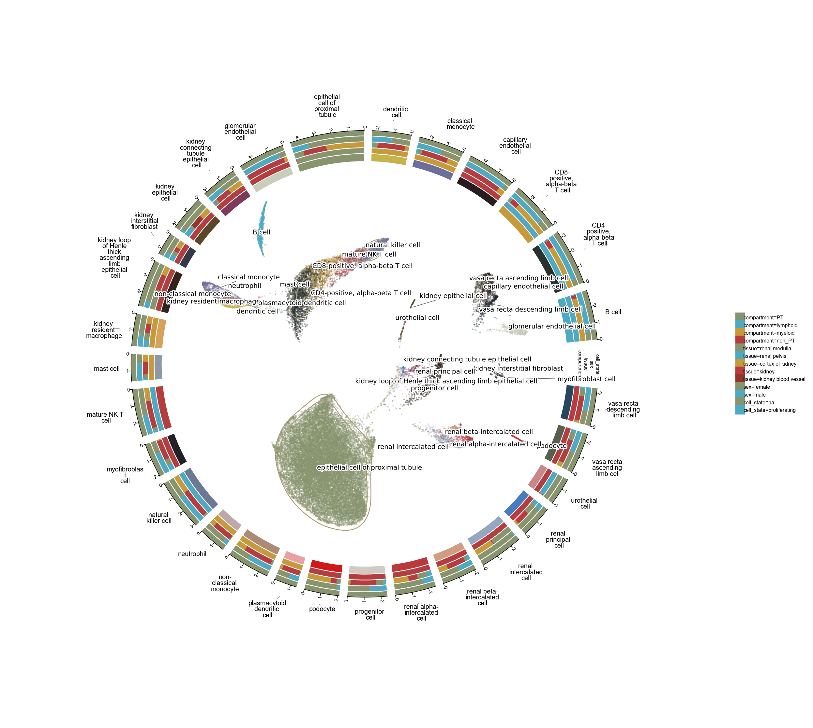

# 我做了一个明日方舟干员主题科研配色包：arkplatte

有一件事我拖了挺久。

科研图已经画出来了，统计也跑完了，最后卡在配色上。默认配色太随机，自己手动挑又很容易越调越怪。尤其是单细胞图，细胞类型一多，颜色在 UMAP 上挤成一片，图例看着还行，放到正文里就开始难受。

所以我做了一个小包：`arkplatte`。

它把明日方舟干员的主题色整理成可以直接用于科研绘图的 R 包和 Python 库。现在覆盖 417 名干员，每名干员有 8 个核心色和 1 个分类锚点色。六星干员做了人工校准，尽量让颜色来自角色本体，减少背景、特效和召唤物对主题色的影响。

项目地址：  
[https://github.com/Misaka-15134/arkplatte](https://github.com/Misaka-15134/arkplatte)

在线教程：  
[https://misaka-15134.github.io/arkplatte/](https://misaka-15134.github.io/arkplatte/)

---

## 先看几张色板

下面这 4 个是我先拿来做展示的干员。每张图左侧是立绘，右侧是固定校准表里的 8 个核心色。

|  |  |
|---|---|
|  |  |
|  |  |

这个包的思路很简单：先把干员主题色固化下来，然后按科研图的需求生成不同类型的色板。

我目前主要做了 4 类：

- 核心色：适合直接拿来做分组颜色。
- 单向连续色：适合表达量、丰度、评分、概率。
- 双向连续色：适合差异值、相关系数、残差。
- 分类色：适合样本分组、细胞类型、通路分类。

单细胞图还额外做了一个分层配色函数。大类可以绑定一个干员主题，小类在同一个主题里面自动挑颜色。比如 B 细胞类群用凯尔希主题，Plasma cell、Memory B cell 再从凯尔希这套颜色里找更合适的小类颜色。

---

## 安装

Python：

```bash
pip install "git+https://github.com/Misaka-15134/arkplatte.git#subdirectory=python"
```

R：

```r
install.packages("remotes")
remotes::install_github("Misaka-15134/arkplatte", subdir = "R")
```

---

## 最小用法

Python：

```python
import arknights_palette as akp

akp.arkplatte("浊心斯卡蒂", 6)
akp.arkplatte_seq("塑心", 7)
akp.arkplatte_div("浊心斯卡蒂", 7)
akp.arkplatte_cat(8, seed=1)
```

R：

```r
library(arknightsPalette)

arkplatte("浊心斯卡蒂", 6)
arkplatte_seq("塑心", 7)
arkplatte_div("浊心斯卡蒂", 7)
arkplatte_cat(8, seed = 1)
```

几个常用函数：

| 函数 | 用途 |
|---|---|
| `arkplatte()` | 取某个干员的核心色，也可以切换为连续色或双向色。 |
| `arkplatte_seq()` | 单向连续色，适合 0 到 1、表达量、丰度和得分。 |
| `arkplatte_div()` | 双向连续色，适合 -1 到 1、差异值、残差和相关系数。 |
| `arkplatte_cat()` | 跨干员分类色，类别多的时候会按 Lab 色彩距离挑更分散的颜色。 |
| `arkplatte_cell()` | 给细胞类型直接分配颜色。 |
| `arkplatte_sub()` | 大类绑定干员主题，小类在主题内自动选色。 |
| `arkplatte_names()` | 查看可用干员，默认返回全部干员。 |
| `arkplatte_info()` | 查某个干员的编号、职业、分支和数据来源。 |

---

## 一些常见图

下面这些图都是用 `arkplatte` 的颜色画的。我想要的效果是：图看起来干净，颜色有角色味道，也能符合科研图的阅读习惯。

### 正负柱状图

这里用了浊心斯卡蒂的双向色板。正负值需要明确的方向感，蓝色和红色刚好适合。

```python
div = akp.arkplatte_div("浊心斯卡蒂", 7)
colors = [div[6], div[5], div[1], div[0], "#8F3343"]
ax.axhline(0, color="#AFAFAF")
ax.bar(labels, values, yerr=err, color=colors)
```


### 折线图

同一个干员主题里取几条相近但能分开的颜色，用来画同一组实验的不同条件。



### 散点和气泡图

大类用不同干员的主题色，点的大小再编码一个连续变量。



### 热图

热图里我更喜欢用双向色板，尤其是表达量标准化、残差、相关矩阵这种有中心值的场景。

```python
cmap = akp.arkplatte_cmap("乌尔比安", "div", 9)
ax.imshow(mat, cmap=cmap, vmin=-2.4, vmax=2.4)
```


### 分组小提琴图

小提琴图适合展示分布。这里颜色需要有区分度，同时不能太刺眼。



### 森林图

森林图用了维什戴尔的多点配色。每一行一个颜色，读起来会比单色更轻松一点。


---

## 生信图也顺手画了一遍

这个包一开始就是冲着科研图和生信图去的，所以我也做了一组常见图的示例。

### 火山图

火山图里颜色最好服务于阈值和方向。显著上调、显著下调、中性点各自有清晰位置。



### Marker 基因点图

点图的颜色和大小本来就有信息量，配色如果太乱，读图成本会明显变高。



### 通路富集图

这类图我会优先保证排序、标签和颜色层级都能看清。



### PCA 样本图

PCA 图常见问题是组间颜色太接近。这里用跨干员分类色，让每组之间的感知距离拉开。



---

## 单细胞：UMAP 和 plot1cell

单细胞图是我最想解决的场景。

UMAP 里的颜色很难只靠“好看”判断。类别数量、点密度、层级关系、颜色距离都要一起看。尤其是大类和小类同时存在的时候，如果每个细胞类型都随机取一个颜色，图会很快失控。

普通细胞类型颜色可以这样取：

```python
celltypes = adata.obs["cell_type"].astype(str)
cluster_palette = akp.arkplatte_cell(celltypes, seed=4)
```

如果有大类和小类，可以这样：

```python
subtype_map = {
    "Immune": ["T cell", "B cell", "Macrophage"],
    "Epithelial": ["AT1", "AT2"],
}

group_operator = {
    "Immune": "凯尔希",
    "Epithelial": "浊心斯卡蒂",
}

subtype_palette = akp.arkplatte_sub(subtype_map, group_operator)
```

### kidney50k UMAP

这里用的是公开单细胞数据示例。大类和小类用不同分辨率配色，小类颜色尽量保持在对应大类的主题范围里。



### lung10k plot1cell

`plot1cell` 的圆形布局很吃配色。颜色距离不够的时候，环形图会显得特别拥挤。



### kidney50k plot1cell

kidney50k 的类别更多，所以这里用了更多干员主题来分散大类颜色，再用同主题内的小类色保持层级关系。



---

## 这个包目前怎么取色

我尽量参考了 Genshinpalette 的思路：包里不动态读取图片，也不保存原始立绘；函数读取固定的颜色表。

颜色表来自头像近景和人工校准。头像近景主要是为了减少背景影响，六星干员额外做了人工校准。后续如果有人觉得某个干员“不像本人”，可以直接提 issue，我会继续修。

连续色阶用 Lab 感知色彩空间插值，并且强制亮度单调。双向色阶会让中点更亮，两端亮度尽量对称。分类色会按 Lab 距离挑选分散颜色；超过 30 个类别时，默认会提醒用户考虑分组、分面或上层注释。

听起来有点啰嗦。实际使用的时候就是一行函数。

---

## 最后

这个包算是一个带点个人趣味的科研绘图工具。

我希望它能在真实绘图里省一点时间：热图、火山图、森林图、UMAP、plot1cell，至少不用每次都重新纠结颜色。

如果你刚好也写 R、Python，或者经常画单细胞图，可以试一下。

项目地址：  
[https://github.com/Misaka-15134/arkplatte](https://github.com/Misaka-15134/arkplatte)

在线教程：  
[https://misaka-15134.github.io/arkplatte/](https://misaka-15134.github.io/arkplatte/)

安装命令再放一次：

```bash
pip install "git+https://github.com/Misaka-15134/arkplatte.git#subdirectory=python"
```

```r
install.packages("remotes")
remotes::install_github("Misaka-15134/arkplatte", subdir = "R")
```
